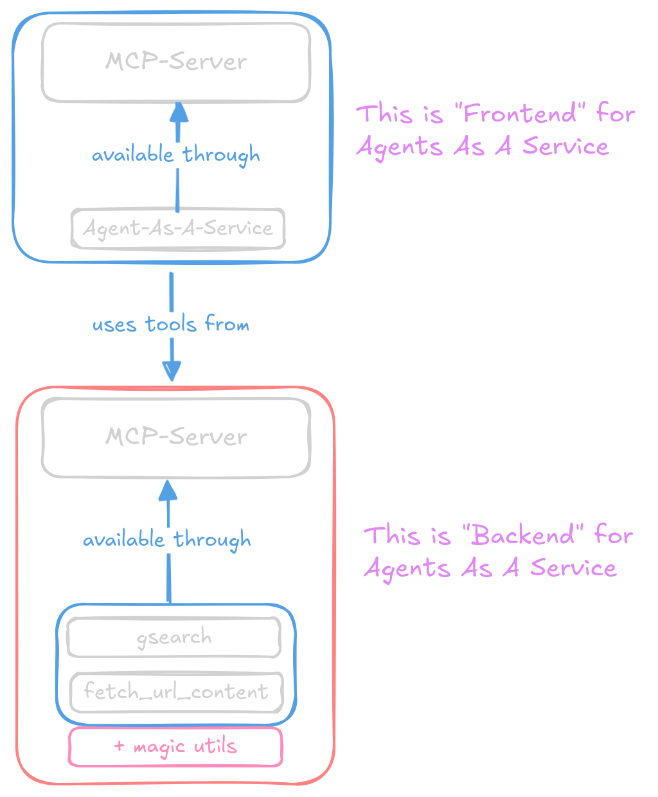

# Agents as a Service – MCP Search Agent

Hey there. This project is still somewhat under construction (it works already, just hasn't earned that bow yet).
MCP is nothing new, agents are nothing new, tools are nothing new — so what's new?

## What's Actually Different

1. This may be biased, but it's subjectively the best agentic deep research tool currently available.
2. Agents as a Service Architecture – you can plug it into MCP as a single tool (search), without exposing all the nested tools running under the hood.
3. Speed – unlike what you'll typically find in the wild, this is compiled code. That means significantly faster responses.  
   (The LLM still takes however long it takes — not part of my code.)

## Open Todos
- [x] proper multistage build + publish to dockerhub for faster deployment
- [ ] proper docs (eg instructions how to run, build, etc
- [ ] tests (yep still missing those, getting lazy there)
- [ ] reverse proxy (traefik)
- [ ] protection (api-keys, so not anyone on the wide wild web can just suck on your mcp goodies)

## Roadmap
- [ ] langfuse for eval and observability
- [ ] redis + endpoint to fetch results used for final response of last query by UID

---

Have a look for now :D

